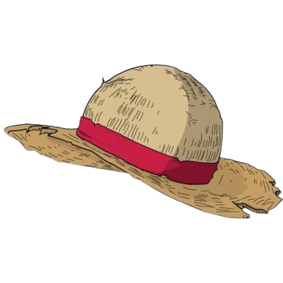

# AutoOnePiece

A silly little program for Jimmy here

Used to find Youtube Videos with one piece in it.

 
 

# Installation

### Clone this repo
`git clone https://github.com/Leo-Aqua/AutoOnePiece.git`

### install requirements

`pip install -r requirements.txt`

### Run

`python main.py`

